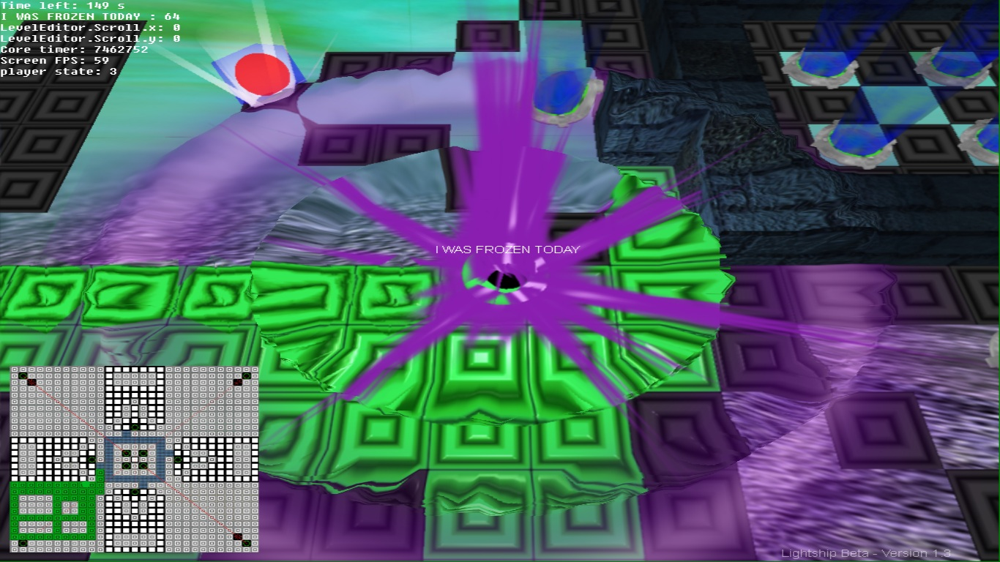
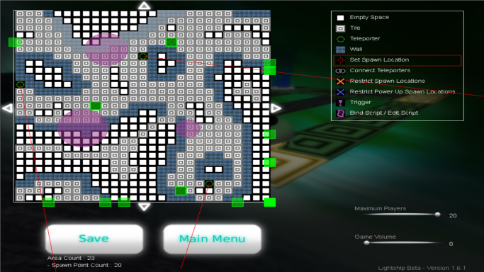

Lightship
---------

This  game is all about area control. The aim is to claim  as  many  tiles  as
possible. You do so by flying around with your UFO and any tile that's beneath
you becomes yours. Other players will attempt to do  the  same, and the player
who  has  the  most  tiles  after  the  game  timer  expires  is  the  winner.

The game supports networked multiplayer with  up  to  20  players and it has a
powerful map editor.

Video:

