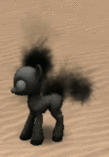
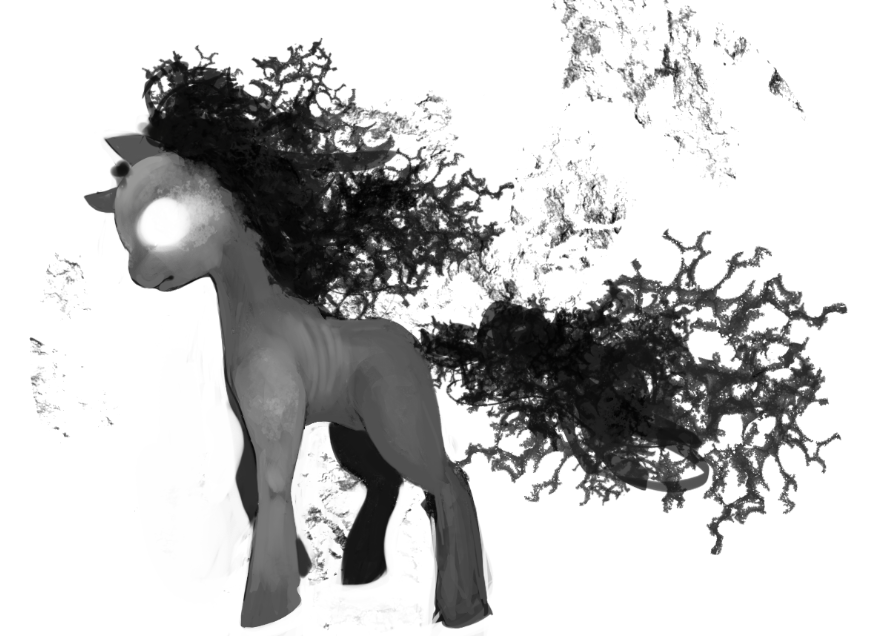
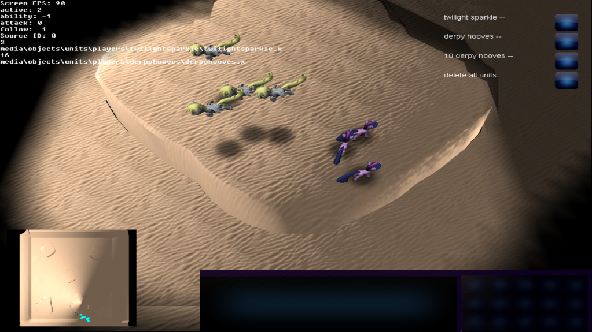
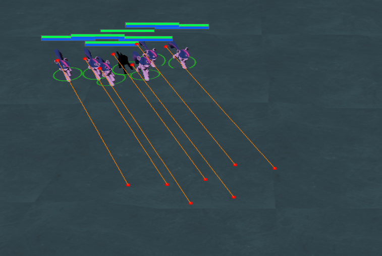
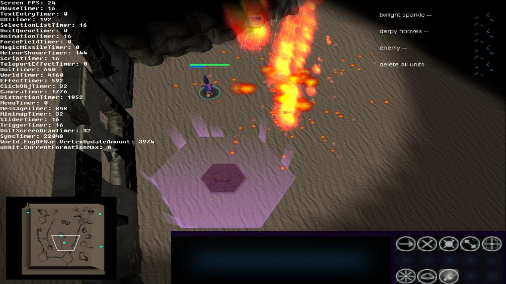
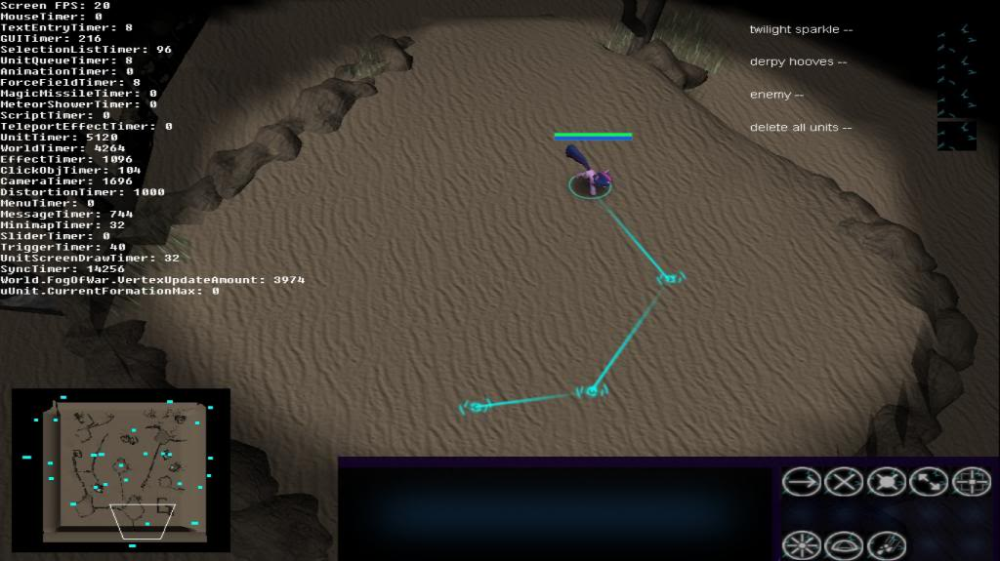

PonyCraft
---------

You all knew  this  was  coming,  sooner  or  later someone would have to have
snapped  and traded their sanity for the colourful kindness that is My  Little
Pony : Friendship is Magic.  I  didn't  see it being me but hey, it's me. Deal
with it.

PonyCraft is an *attempt* at an RTS  game  with ponies. It's somewhat playable
but I realized the scope  of the game was just too large for me to manage, and
the code was getting very messy.

Tips
----
  - Press attack (hotkey: "T") and then click on the ground to target any enemies in that area
  - Middle mouse button can pan the camera
  - It's easier to look around by moving the mouse to the edge of the screen
  - Use the hotkeys for commands (they are on top of the buttons)
  - CTRL+<number> will create a control group. If you press <number>, you will select the units you added to the group again.
